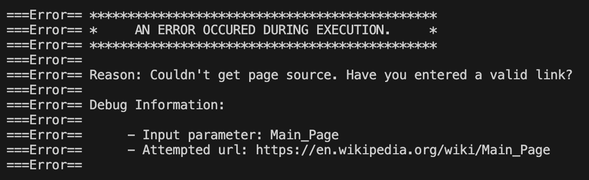
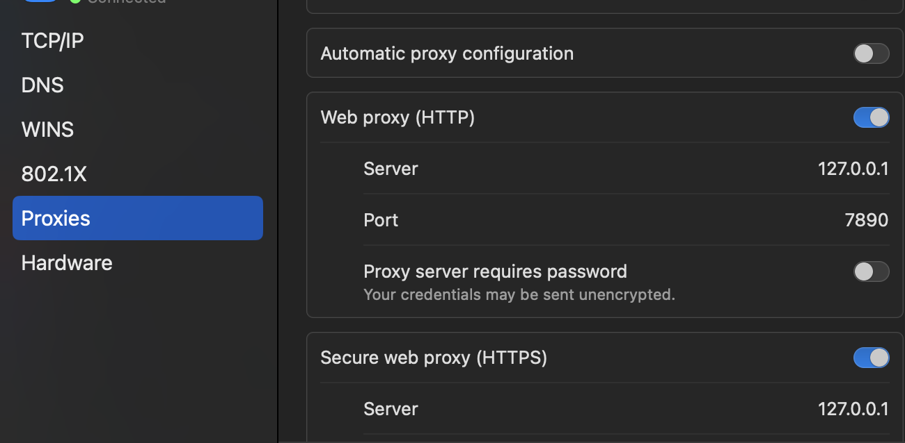
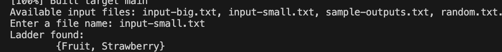
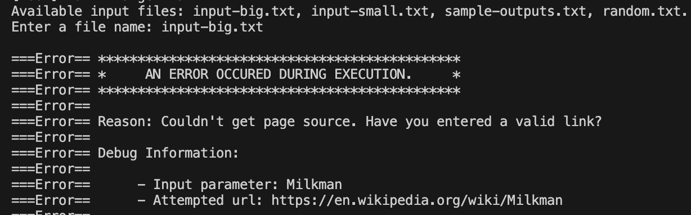

# README

Welcome to CS106L! >w<

## Assign1:WikiRacer

Well the crux here actually lies in the web part. I have no access to wiki cuz of the wall : ) However, it can be fixed using the method below.



First, find the Proxy Server IP and Port. This can be found on our computer's System Settings/Network. On my computer, they're: `http://127.0.0.1:7890`


Then edit the code in `wikiscraper.cpp`. Instead directly access the website, we need to create a session, set its proxies to the Proxy Server IP and Port we found in Step1.

```cpp
    cpr::Proxies proxies{{"http", "http://127.0.0.1:7890"},
                         {"https", "http://127.0.0.1:7890"}};
    // Create a cpr::Session object and set the proxies
    cpr::Session session;
    session.SetProxies(proxies);
    session.SetUrl(cpr::Url{url});
    // Make the GET request using the session
    cpr::Response r = session.Get();

    // cpr::Response r = cpr::Get(cpr::Url{url});
```

Aha! It works smoothly now. 😆



However, it only works on small dataset. When the ladder's too long and we need to create session for each page, the method fails to work again. : )  However we can use small data to confirm that our code's correct. Hooray!

