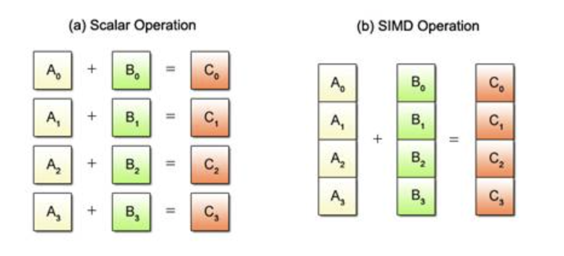

# `std::execution`

The Parallel Algorithms library, introduced in C++17 as part of the Standard Template Library (STL), extends existing STL algorithms by adding support for parallel execution. This feature is designed to take advantage of modern multi-core processors, allowing for significant performance improvements by executing work concurrently across multiple threads or vectorizing operations to run them in parallel using a single instruction on multiple data points.

## Execution Policies

Parallel algorithms in C++17 and later versions can be executed under different policies, controlled by specifying an execution policy argument. These policies determine how the algorithm's work is divided and executed. The standard defines several execution policies:

- **`std::execution::seq`**: Indicates that the algorithm should execute sequentially in a single thread. **This is the default behavior of algorithms if no execution policy is specified.**
- **`std::execution::par`**: Specifies that the algorithm can execute in parallel, distributing work across multiple threads. This policy is suitable for operations that can be safely executed in parallel without requiring any particular order of execution.
- **`std::execution::par_unseq`**: Allows the algorithm to execute in parallel and also permits vectorization, **enabling unsequenced execution within threads**. This is the most aggressive form of parallelization and requires that operations be safe to execute without any inter-dependencies that mandate a specific sequence of execution.
- **`std::execution::unseq`**: Focuses on unsequenced (vectorized) execution within a single thread, suitable for SIMD optimizations without parallelism.

## How to Use

To use `std::execution::par` or any other execution policy, you must include the `<execution>` header in your program. Here's an example of how to use `std::execution::par` with the `std::sort` algorithm:

```cpp
#include <algorithm>
#include <vector>
#include <execution>  // Include for execution policies

int main() {
    std::vector<int> data = {9, 5, 2, 7, 4, 6, 3, 8, 1, 0};

    // Sort data in parallel
    std::sort(std::execution::par, data.begin(), data.end());

    // Now 'data' is sorted
}
```

In this example, the `std::sort` algorithm is instructed to sort the vector `data` in parallel by specifying `std::execution::par` as the first argument. The algorithm will attempt to distribute the sorting work across multiple threads, potentially speeding up the operation on systems with multiple cores.

## Considerations and Best Practices

- **Thread Safety**: When using parallel execution policies, ensure that any function or operation used in the algorithm is thread-safe. This includes avoiding data races, ensuring proper synchronization (if needed), and considering the thread safety of any invoked functions.
- **Overhead**: Parallel execution introduces overhead due to thread management. For small datasets or simple operations, the overhead may outweigh the benefits of parallel execution. It's generally recommended to use parallel algorithms for large datasets or computationally intensive tasks.
- **Hardware Concurrency**: The performance improvement gained from using parallel execution policies depends on the hardware's ability to execute operations concurrently. This is typically related to the number of available CPU cores.
- **Compiler and Library Support**: Ensure your development environment supports C++17 or later, and the standard library implementation includes support for parallel algorithms. Some environments may require you to link against specific libraries (e.g., TBB, Threading Building Blocks, for GCC) to enable parallel execution support.

## What is unsequenced execution ?



Unsequenced execution, particularly in the context of C++ and its parallel algorithms library, refers to the execution of operations where there is no specified order between them within a single thread of execution. This concept is crucial for understanding how certain execution policies, like `std::execution::unseq` and `std::execution::par_unseq`, optimize algorithm performance through vectorization.

**Vectorization and SIMD**

Vectorization, often achieved through SIMD (Single Instruction, Multiple Data) instructions, allows a processor to execute a single instruction on multiple data points simultaneously. For example, a SIMD instruction might add four pairs of floating-point numbers in the time it would normally take to add a single pair. This is a form of parallelism at a lower level (within a single core) compared to multi-threading, which involves multiple cores.

**Unsequenced in C++**

In C++, unsequenced execution means that the compiler and runtime system may execute operations in any order, or even simultaneously, as long as the logic of the program is not affected. This freedom allows compilers to optimize code for speed, especially when using execution policies designed for vectorization (`std::execution::unseq`) or combining vectorization with multi-threading (`std::execution::par_unseq`).

**Implications of Unsequenced Execution**

- **Performance Gains**: By allowing operations to be executed in an unsequenced manner, programs can leverage the full power of modern CPUs' SIMD capabilities, leading to significant performance improvements for suitable workloads.
- **Thread Safety and Data Races**: When operations are unsequenced, care must be taken to ensure that they do not interfere with each other. For example, two unsequenced operations writing to and reading from the same memory location without proper synchronization could lead to undefined behavior due to a data race.
- **Functional Requirements**: Operations suitable for unsequenced execution must be independent of each other; that is, the result of any operation should not depend on the execution order relative to other operations in the set. This requirement is similar to but distinct from the requirements for parallel execution across threads.

**Practical Example**

Consider a simple operation like scaling an array of numbers by a constant factor. If each scaling operation is independent of the others (the scaling of one element does not depend on the scaling of any other element), then these operations can be executed in an unsequenced manner, potentially all at once if the hardware supports it.

```cpp
#include <vector>
#include <algorithm>
#include <execution>

void scale(std::vector<float>& v, float factor) {
    std::transform(std::execution::unseq, v.begin(), v.end(), v.begin(),
                   [factor](float value) { return value * factor; });
}
```

In this example, if the compiler and hardware support it, the scaling operations might be vectorized, applying the scaling factor to multiple elements of `v` simultaneously.

Unsequenced execution and vectorization are powerful tools in modern C++ for optimizing performance-critical code. However, leveraging these features requires a good understanding of their implications on program correctness and performance.